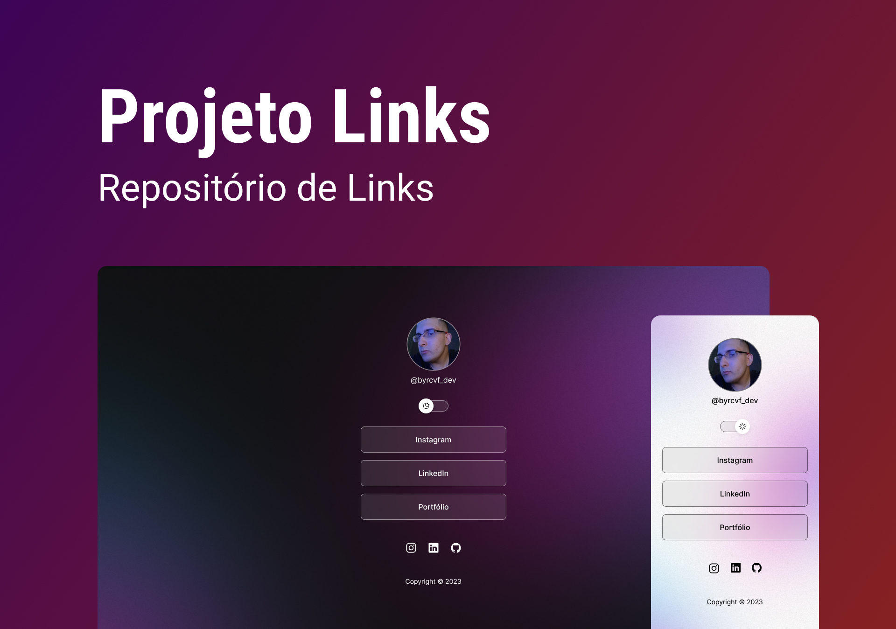

<h1 align="center"> Projeto Links </h1>

 

  
  
O projeto Links é um repositório de links online!

## 🚀 Tecnologias

Esse projeto foi desenvolvido com as seguintes tecnologias:

- HTML e CSS
- JavaScript
- Git e Github
- Figma

## 💻 Projeto

O projeto Links é um repositório de links para usar como cartão de visitas de forma online.

- [Tenha o projeto finalizado clicando aqui! ](https://github.com/byrcvf/projeto_links)

---

Projeto desenvolvido por @byrcvf_dev 👋
(Embarque nessa jornada também, venha para a Rocketseat ♥)